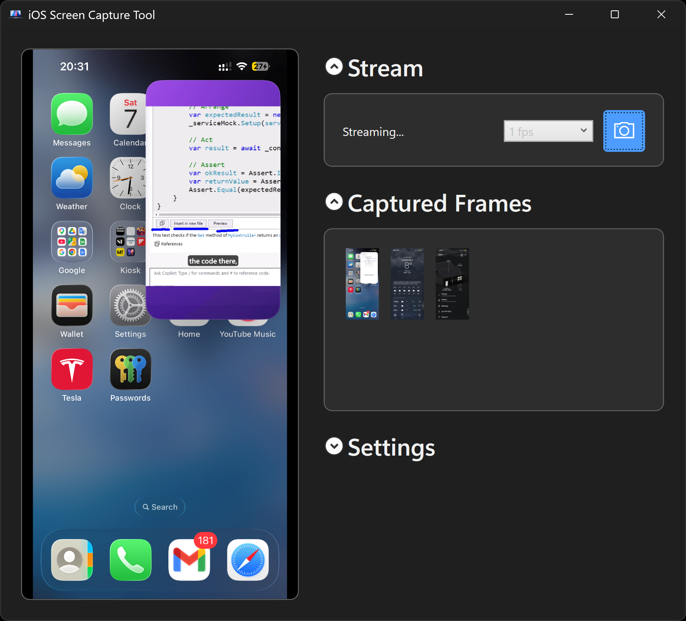

# iOS Screen Capture Tool

Mirror your iPhone or iPad screen on your Windows PC over USB - no extra software on the device, no Wi-Fi needed.



## What you can do with it

- **See your iOS screen on your Windows PC** - live preview at up to 60 fps, just plug in the USB cable.
- **Grab screenshots instantly** - click the camera button, use the tray menu, or trigger one from any terminal with a single command.
- **Let AI see your screen** - GitHub Copilot, Claude, Codex, or any automation can call one command to capture a frame and reason about what's on the device. Verify a UI looks correct, check whether a web page rendered right, or catch visual bugs automatically - without a human ever looking at the device.
- **Runs quietly in the tray** - close the window and the stream keeps going in the background. Right-click the tray icon to grab a shot or exit.
- **Reconnects automatically** - unplug and replug the cable and the stream resumes on its own.
- **Starts with Windows** - optional startup entry launches the app minimized so it is always ready.

---

## Setup

**What you need:** a Windows 10 or later PC, a Lightning or USB-C cable, and your iPhone or iPad with Developer Mode enabled (see below how to turn it on).

**Step 1 - Download the app:**

Download the latest `IosScreenCaptureTool-win-x64.zip` from the [Releases](https://github.com/BieleckiLtd/IosScreenCaptureTool/releases) page, extract all files to a folder, and run `IosScreenCaptureTool.exe`. No additional runtime installation is required.

Or run from source (requires the [.NET 10 SDK](https://dotnet.microsoft.com/download)):

```powershell
git clone https://github.com/BieleckiLtd/IosScreenCaptureTool.git
cd IosScreenCaptureTool
```

**Step 2 - Turn on Developer Mode on the device** (iOS 16 or later, one-time setup):

Screen capture uses Apple's Developer Tools services on the device. Starting with iOS 16, those services only work when Developer Mode is switched on. **This must be done once before the app can stream.** Until it is on, the app will find your device and open a tunnel but every frame capture will fail.

> On iOS 15 and earlier there is no Developer Mode switch — skip this step entirely.

**What's required:**
1. Device and USB cable.
2. Mac with Xcode installed.

**How to enable it:**

The Developer Mode toggle is hidden from Settings until a development tool requests it. To make it appear, the app sends that request automatically on first connection - but you still need to go into Settings and flip the switch yourself.

1. Make sure your device is plugged in and unlocked.
2. Start the app (Step 4 below) and wait a few seconds while it connects.
3. On the device, open **Settings → Privacy & Security**.
4. Scroll to the bottom - **Developer Mode** should now be listed.
5. Tap **Developer Mode**, toggle it on, and tap **Restart**.
6. After the device reboots, unlock it and tap **Turn On** when the confirmation dialog appears.
7. Reconnect the cable if needed - the app will pick up the stream automatically.

**Step 3 - Plug in your iPhone or iPad**, unlock it, and tap **Trust This Computer** if a prompt appears on the device.

**Step 4 - Start the app:**

```powershell
dotnet run --project IosScreenCaptureTool
```

Windows will ask for Administrator permission - click **Yes**. This is required so the app can open the low-level connection iOS needs for screen mirroring.

On the very first run the app downloads and installs Python 3.12 and [pymobiledevice3](https://github.com/doronz88/pymobiledevice3) automatically. This takes about a minute and only happens once.

---

## Using the app

After launch the window shows your iOS screen on the left. On the right you have:

- A **frame-rate selector** (1 / 5 / 25 / 30 / 60 fps).
- A **camera button** that saves a screenshot to your chosen folder immediately.
- A **Captured Frames** list — double-click any entry to open it, right-click to copy the file path.
- A **Settings** panel to change the capture folder and startup options.

### System tray

Minimize or close the window and the app continues running in the notification area. Right-click the tray icon to **Grab Screenshot**, reopen the window, or **Exit**.

### Capture a screenshot from the command line

While the app is running (window or tray), open any terminal - even a non-Administrator one - and run:

```powershell
dotnet run --project IosScreenCaptureTool -- --capture-frame .\screenshots\frame.png
```

The file is written within milliseconds. The folder is created automatically if it does not exist. Exit code is `0` on success and `1` on failure.

---

## Using it with AI agents

Because `--capture-frame` is a plain command-line call that writes an image file, any AI tool that can run a process and read a file can use it to *see* the device screen.

```powershell
# Call this from a GitHub Copilot agent, Claude tool-use, a Codex function, a CI step, or any script:
dotnet run --project IosScreenCaptureTool -- --capture-frame .\check.png
# → hand check.png to the AI and ask it what it sees
```

**Things you can automate:**

- **Verify a UI change** - ask the agent whether the updated screen looks correct before merging a PR.
- **Check a web page on a real device** - navigate to a URL, capture, ask if the layout and content are right.
- **Visual regression in CI** - capture before and after a build, compare with an AI or diff tool.
- **Hands-free QA** - the agent flags anything unexpected on the device screen without a human ever looking.

> **Important:** the app must already be running before you call `--capture-frame`. The first launch requires a UAC prompt, so headless agents (Codex, Copilot, etc.) cannot start it on their own. Start it manually once (or set it to start with Windows) and leave it in the tray.

### One-shot test without opening the window

Use this to confirm the device connection is working in one command, then exit:

```powershell
dotnet run --project IosScreenCaptureTool -- --self-test .\screenshots\test.png
```

If you downloaded the release `.exe` instead of running from source:

```powershell
.\IosScreenCaptureTool.exe --self-test .\screenshots\test.png
```

Exit code `0` means a real frame was successfully captured. Useful as a health-check at the start of a CI pipeline before longer automation begins.

---

## Settings

| Setting | Where to find it | What it does |
|---|---|---|
| **Capture folder** | Settings → Browse… | Folder where screenshots are saved. Default: `Pictures\iOSLiveStream`. |
| **Start on startup** | Settings checkbox | Launches the app minimized to tray every time Windows starts. |
| **Keep minimized after closing** | Settings checkbox | Closing the window hides to tray instead of quitting. Enabled by default. |
| **FPS** | Stream panel dropdown | How often the preview refreshes (1 / 5 / 25 / 30 / 60 fps). |

---

## Troubleshooting

| Problem | What to try |
|---|---|
| "Stream failed - Developer Mode may not be active" or "Stream interrupted" in a loop | Developer Mode is off. See above how to turn it on. | 
| Developer Mode toggle missing from Settings | Connect the device and start the app at least once. The `amfi enable-developer-mode` request makes the toggle appear. Then go to Settings and enable it. |
| Blank screen or stuck on "Idle" | Unlock your device and tap **Trust**. Wait a few seconds for the connection to open. |
| No Administrator prompt appears | Launch from a normal (non-elevated) terminal. The app elevates itself. |
| First-run install fails | Install [Python 3.12](https://www.python.org/downloads/) manually, then restart the app. |
| `--capture-frame` says app not found | The GUI must be running first. Start it, wait for the stream to show, then run the command. |

---

## License

MIT - free to use, modify, and distribute.
